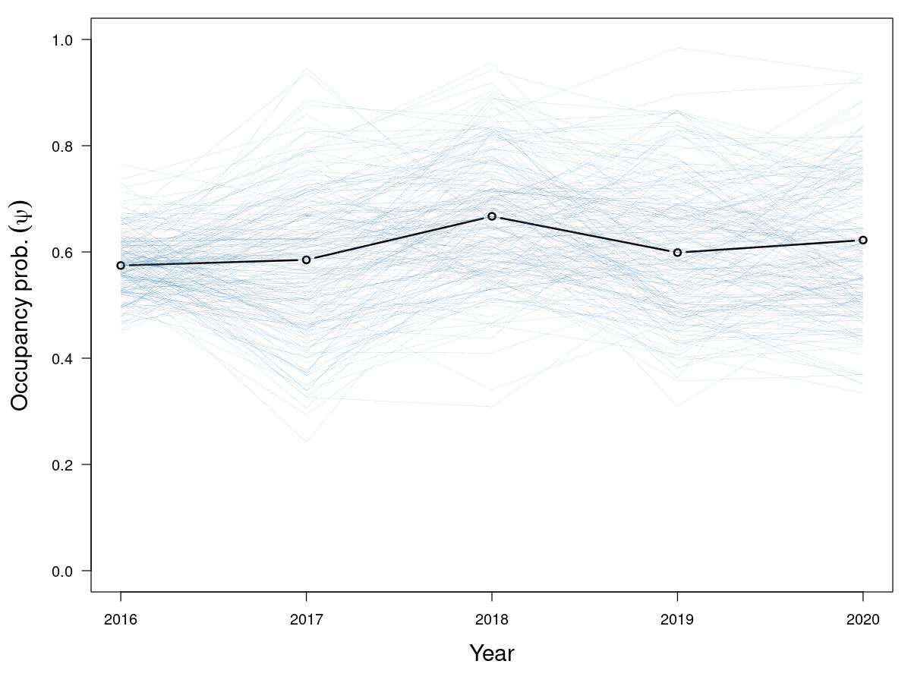
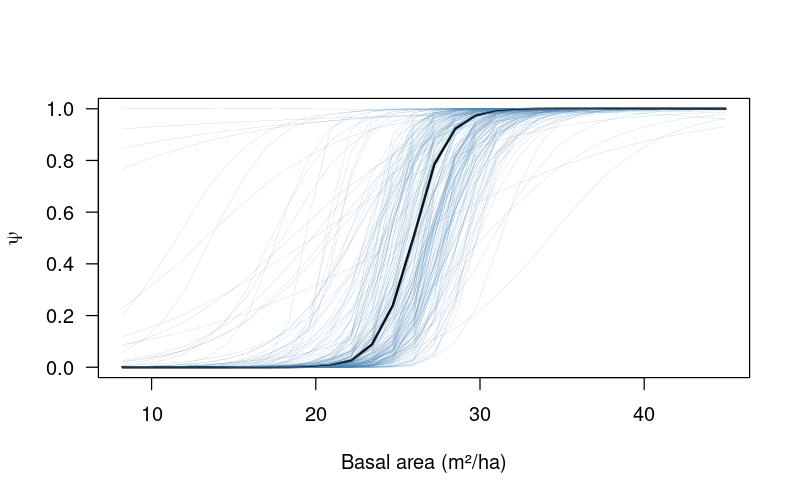

# Psophia-obscura

Estudo sobre a conservação do jacamim-das-costas-escuras *Psophia obscura* na REBIO do Gurupi.
Por Elildo Carvalho Jr, Alexandre Martins e Eloisa Mendonca.
Para artigo em preparação


### Descrição
```src``` Este diretório contém os códigos para as análises.

```data``` Dados brutos e processados. 

```bin``` Um conjunto de códigos úteis para consertar os dados brutos ou funções que são chamadas pelos códigos da análise.

```results``` Contém resultados das análises, como tabelas, figuras, etc. 






# Contato
Se tiver questões entre em contato com <elildojr@gmail.com>
